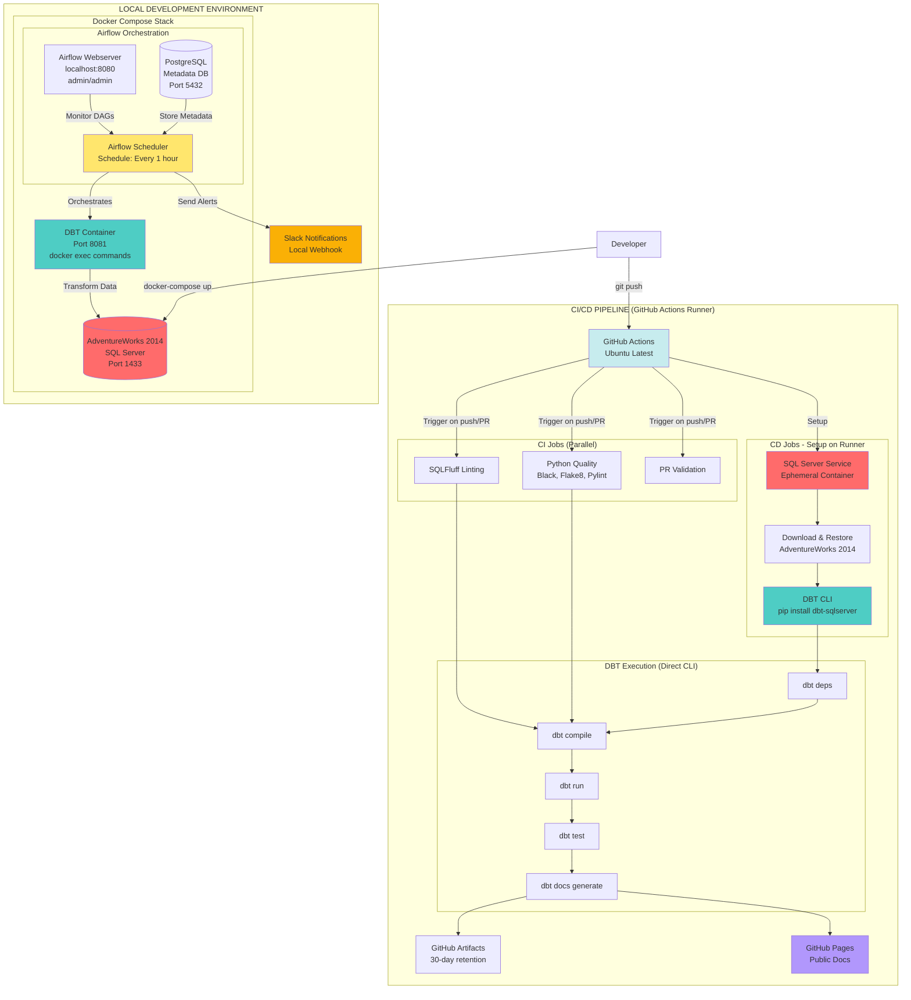
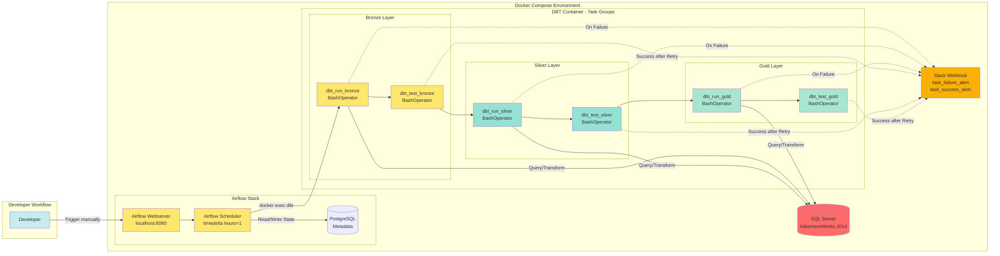
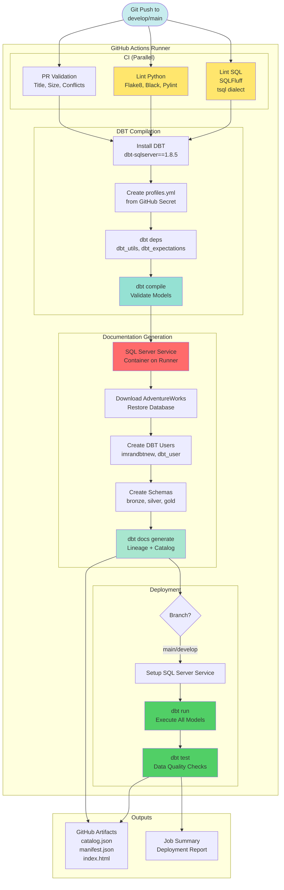
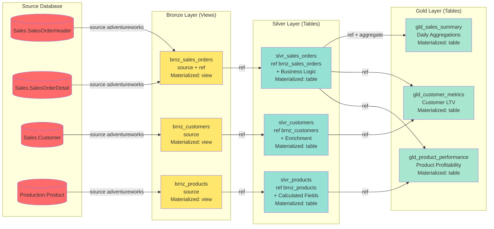

# DataOps Pipeline Architecture Diagrams

## 1. Overall Architecture - Local vs CI/CD



**Key Points:**
- **Local:** Airflow runs 24/7 in Docker, schedules DBT transformations
- **CI/CD:** GitHub Actions runs DBT directly via CLI (NO Airflow)
- **Scheduling:** Only happens in local Airflow, NOT in GitHub Actions

---

## 2. Local Development with Airflow DAG



**Task Flow:**
```python
# airflow/dags/dbt_dag.py
bronze_group >> silver_group >> gold_group

# Each group:
dbt_run_<layer> >> dbt_test_<layer>
```

---

## 3. CI/CD Pipeline (GitHub Actions Only)



**Important:** GitHub Actions uses **direct DBT CLI**, NOT Airflow orchestration.

---

## 4. DBT Medallion Architecture Layers



**Model Reference Patterns:**
```sql
-- Bronze: Extract from source
{{ source('adventureworks', 'SalesOrderHeader') }}

-- Silver: Transform bronze models
{{ ref('brnz_sales_orders') }}

-- Gold: Aggregate silver models
{{ ref('slvr_sales_orders') }}
```

---

## 5. Environment Comparison

| Aspect | Local (Docker Compose) | CI/CD (GitHub Actions) |
|--------|------------------------|------------------------|
| **Orchestration** | ✅ Airflow DAGs | ❌ Direct DBT CLI |
| **SQL Server** | ✅ Persistent Container | ✅ Ephemeral Service |
| **DBT Execution** | `docker exec dbt dbt run` | `dbt run` |
| **Scheduling** | ✅ timedelta(hours=1) | ❌ Event-driven only |
| **Notifications** | ✅ Slack Webhook | ❌ GitHub Summary |
| **Purpose** | Development & Demo | Automated Deployment |
| **Runs** | Continuously (24/7) | On git push/PR |
| **State Management** | ✅ PostgreSQL Metadata | ❌ Stateless |
| **Retry Logic** | ✅ Exponential Backoff | ⚠️ GitHub Actions retry |

---

## Architecture Decision Rationale

### Why Airflow Only in Local?

**For Learning/Demo (Current Project):**
- ✅ Demonstrates production-like orchestration
- ✅ Shows scheduling capabilities
- ✅ No cloud infrastructure cost
- ✅ Easy to debug and iterate

**For Production (Future):**
- Would deploy Airflow to cloud (AWS MWAA, Cloud Composer)
- Airflow runs 24/7 on dedicated infrastructure
- GitHub Actions only for CI/CD, NOT scheduling

### Why GitHub Actions for CI/CD?

**Advantages:**
- ✅ Event-driven (triggers on code changes)
- ✅ Built-in to GitHub (no setup needed)
- ✅ Free for public repos
- ✅ Validates code before deployment

**NOT for:**
- ❌ Regular scheduling (use Airflow)
- ❌ Complex orchestration (use Airflow)
- ❌ State management (use Airflow)
